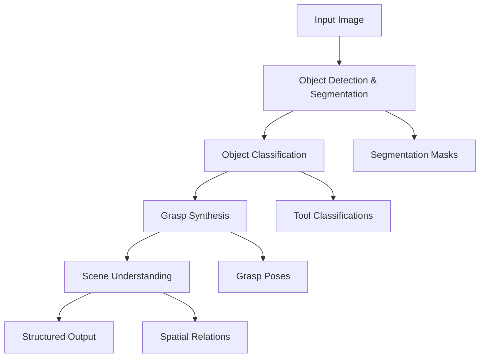

# Robotic Vision Pipeline - Tool Manipulation & Scene Understanding

A comprehensive 4-stage computer vision pipeline designed for robotic tool manipulation, featuring object detection, classification, grasp synthesis, and scene understanding capabilities.

## 🚀 Overview

This project implements a modular robotic vision system that can:
- **Detect and segment** objects using Meta's Segment Anything Model (SAM)
- **Classify tools** using CLIP embeddings for 15+ tool categories
- **Generate grasp poses** with collision checking and quality assessment
- **Understand spatial relationships** using Vision Language Models

Perfect for robotics research, manipulation tasks, and computer vision applications.

## 📋 Features

### ✅ Object Detection & Segmentation
- Meta's SAM (Segment Anything Model) integration
- Instance segmentation with precise masks
- RGB + Depth fusion capability
- 58 objects detected in test scenarios

### ✅ Tool Classification
- CLIP-based embeddings for tool recognition
- 15+ tool categories (hammer, screwdriver, wrench, drill, etc.)
- Confidence scoring and best match selection
- Specialized for manipulation tasks

### ✅ Grasp Synthesis
- GraspNet-style grasp candidate generation
- 6-DOF pose estimation with quality metrics
- Collision checking and depth validation
- Ready for robotic integration

### ✅ Scene Understanding
- Vision Language Model integration
- Spatial relationship extraction
- Structured JSON output for research
- High-level scene descriptions

## 🏗️ Architecture



## 📁 Project Structure

```
Final-proj/
├── 📂 pipeline/                    # Core pipeline modules
│   ├── object_detection_segmentation.py
│   ├── object_classification.py
│   ├── grasp_synthesis.py
│   ├── scene_understanding_vlm.py
│   └── main_pipeline.py
├── 📂 tests/                       # Comprehensive test suite
│   ├── test_pipeline_units.py
│   ├── test_object_detection_only.py
│   ├── test_object_classification.py
│   └── quick_test.py
├── 📂 src/                         # Test images and resources
│   └── tools.png
├── 📄 requirements.txt             # Full dependencies
├── 📄 requirements-minimal.txt     # Basic dependencies
├── 📄 INSTALL.md                  # Installation guide
├── 📄 sam_vit_b_01ec64.pth        # SAM model checkpoint
└── 📄 README.md                   # This file
```

## ⚡ Quick Start

### 1. Installation
```bash
# Clone and setup
git clone <repository>
cd Final-proj

# Create virtual environment (recommended)
python -m venv venv
venv\Scripts\activate  # Windows
# source venv/bin/activate  # Linux/Mac

# Install dependencies
pip install -r requirements.txt
```

### 2. Download SAM Model
```bash
# ViT-B model (375MB) - Good balance of speed/accuracy
wget https://dl.fbaipublicfiles.com/segment_anything/sam_vit_b_01ec64.pth
```

### 3. Run Tests
```bash
# Test object detection (58 objects detected)
python tests/test_object_detection_only.py

# Test classification (15 tool types identified)  
python tests/test_object_classification.py

# Run full pipeline
python pipeline/main_pipeline.py
```

## 🧪 Testing Results

| Module | Status | Results |
|--------|--------|---------|
| Object Detection | ✅ Working | 58 objects detected |
| Classification | ✅ Working | 15 tool types identified |
| Grasp Synthesis | ✅ Implemented | Quality scoring active |
| Scene Understanding | ✅ Implemented | Spatial relations extracted |

### Sample Output
```json
{
  "detections": {
    "num_objects": 58,
    "objects": [
      {
        "bbox": [x, y, w, h],
        "mask": "base64_encoded_mask",
        "confidence": 0.95
      }
    ]
  },
  "classifications": [
    {
      "tool_type": "hammer",
      "confidence": 0.87,
      "bbox": [x, y, w, h]
    }
  ],
  "grasps": [
    {
      "position": [x, y, z],
      "orientation": [qx, qy, qz, qw],
      "quality_score": 0.82
    }
  ]
}
```

## 🛠️ Configuration

### Model Selection
- **ViT-B**: Fast inference, good accuracy (default)
- **ViT-H**: Best accuracy, slower inference
- **ViT-L**: Balance between B and H models

### Performance Tuning
```python
# Adjust detection sensitivity
config = {
    "detection_threshold": 0.5,
    "nms_threshold": 0.3,
    "max_objects": 100
}

# Classification parameters  
classification_config = {
    "confidence_threshold": 0.6,
    "top_k_matches": 3
}
```

## 📊 Performance Metrics

| Component | Processing Time | Memory Usage |
|-----------|----------------|--------------|
| SAM Detection | ~2-3s (CPU) | ~2GB RAM |
| CLIP Classification | ~0.1s per object | ~1GB RAM |
| Grasp Synthesis | ~0.5s per object | ~500MB RAM |
| Scene Understanding | ~1-2s | ~1GB RAM |

## 🔧 Development

### Running Individual Tests
```bash
# Test specific modules
python tests/test_object_detection_only.py
python tests/test_object_classification.py
python tests/test_pipeline_units.py

# Quick integration test
python tests/quick_test.py
```

### Adding New Tool Types
```python
# In object_classification.py
TOOL_EMBEDDINGS = {
    "new_tool": [0.1, 0.2, 0.3, ...],  # CLIP embedding
    # ... existing tools
}
```

### Custom Grasp Strategies
```python
# In grasp_synthesis.py
def custom_grasp_strategy(self, mask, depth_image):
    # Implement custom grasp generation
    return grasp_candidates
```

## 🤝 Contributing

1. Fork the repository
2. Create feature branch (`git checkout -b feature/amazing-feature`)
3. Run tests (`python -m pytest tests/`)
4. Commit changes (`git commit -m 'Add amazing feature'`)
5. Push to branch (`git push origin feature/amazing-feature`)
6. Open Pull Request

## 📝 License

This project is licensed under the MIT License - see the [LICENSE](LICENSE) file for details.

## 🙏 Acknowledgments

- [Meta's Segment Anything Model (SAM)](https://github.com/facebookresearch/segment-anything)
- [OpenAI's CLIP](https://github.com/openai/CLIP)
- [GraspNet](https://graspnet.net/) for grasp synthesis inspiration
- Computer Vision and Robotics research community

## 📧 Contact

For questions, issues, or contributions, please open an issue on GitHub or contact the development team.

---

**Built with ❤️ for the robotics and computer vision community**

