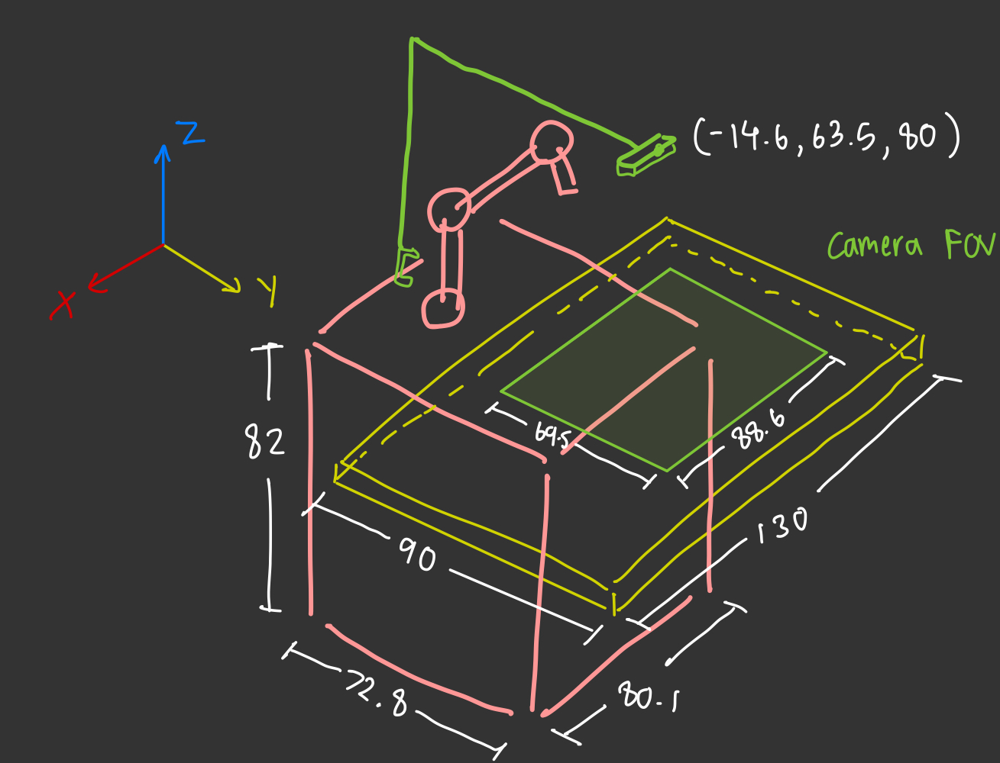

# Hardware Setup and Measurements

> **Note:** All measurements without units are in centimeters

## System Diagram

## Coordinate System

All coordinates are relative to the origin point defined below.

### Reference Points

| Component | Coordinates (x, y, z) | Description |
|-----------|----------------------|-------------|
| **Origin/UR ARM Base** | (0, 0, 0) | Center of the base of the UR Arm
| **Ground Origin** | (0, 0, -82) | Position on the ground directly under the center of the base of the UR Arm, measured from the top surface of the table
| **Depth Camera** | (-14.6, 63.5, 80) | Position of the Intel Realsense D435i Depth Camera |