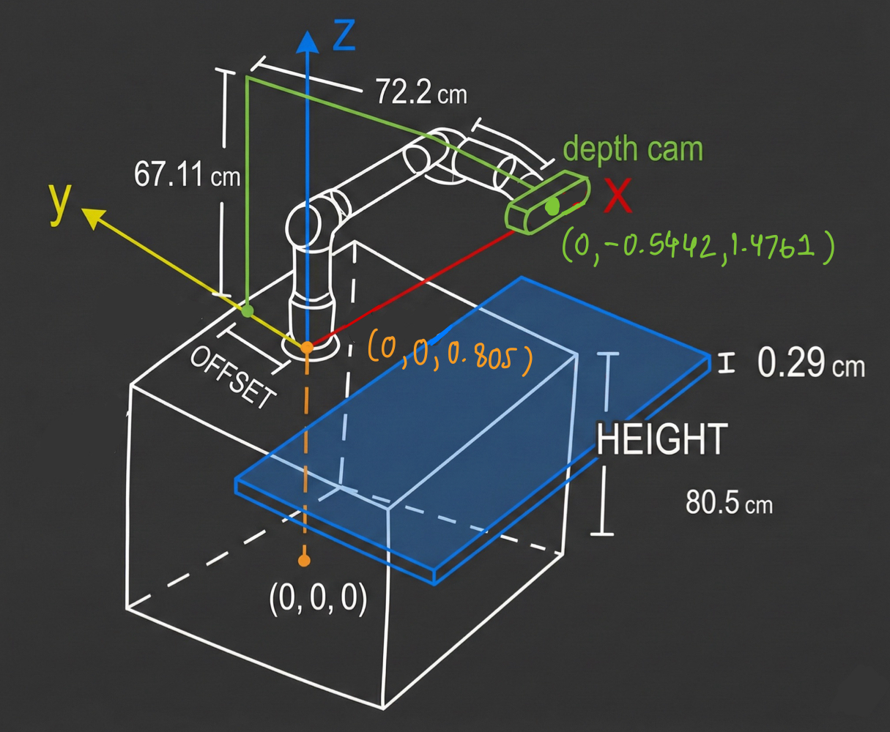

# Hardware Setup and Measurements

> **Note:** All measurements without units are in SI (meters).

## System Diagram

## Coordinate System

All coordinates are relative to the origin point defined below.

### Reference Points

| Component | Coordinates (x, y, z) | Description |
|-----------|----------------------|-------------|
| **Origin** | (0, 0, 0) | Spot on the floor directly under the center of the base of the UR Arm |
| **UR Arm Base** | (0, 0, 0.805) | Center of the base of the UR Arm, measured at the height of the table |
| **Depth Camera** | (0, -0.5442, 1.4761) | Position of the Intel Realsense D435i Depth Camera |

## Key Measurements

| Parameter | Value | Description |
|-----------|-------|-------------|
| **Future Board Width** | 0.29 cm | Width of the future board component |
| **OFFSET** | 17.78 cm | Distance from the center of the UR Arm base to the center of the mounting point of the camera holder |
| **HEIGHT** | 80.5 cm | Distance from the ground to the surface of the UR Arm table |